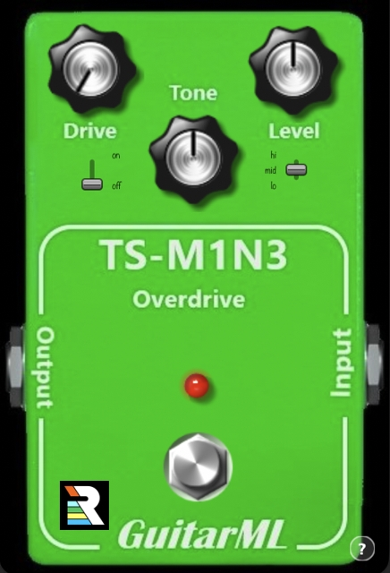
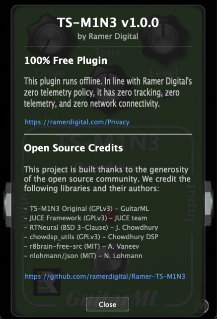

# TS-M1N3

[](https://www.gnu.org/licenses/gpl-3.0) [](https://somsubhra.github.io/github-release-stats/?username=ramerdigital&repository=Ramer-TS-M1N3&page=1&per_page=30)

> [!IMPORTANT]
> **Zero Telemetry Guarantee**: This plugin contains absolutely zero telemetry, zero analytics, zero usage tracking, and zero network connectivity. It runs 100% offline and respects your privacy. Ramer Digital defends zero telemetry.

<p align="center">
  
  
</p>

**TS-M1N3** is a guitar plugin clone of the legendary TS-9 Tubescreamer analog overdrive pedal, fine-tuned exclusively for Apple Silicon. 

### Ramer Digital's Fork Motivation
This repository is an alternative version maintained by **Ramer Digital** (based on the original open-source project by GuitarML). Our motivation is to optimize and experiment with alternative approaches to real-time machine learning in audio DSP, focusing on:
*   **Apple Silicon Native Optimization**: Fine-tuned exclusively for Apple Silicon (native `arm64`, macOS 11.0+) using vectorized instruction sets (vDSP) via Apple's Accelerate framework to achieve optimal CPU efficiency.
*   **Alternative Resampling Architectures**: Implementing lower-latency, hardware-accelerated resamplers to improve real-time playability.
*   **Optimized Parameter Handling**: Exploring zero-latency parameter smoothing and binary neural network weights.
*   **Platform Integration & Stability**: Modernizing code standards and resolving build locks.

### Neural Network Emulation
Unlike static "snapshots" that capture a device at a single setting, TS-M1N3 emulates the entire continuous range of the pedal. The model was trained using two conditioned parameters:
1.  **Drive (Gain)**
2.  **Tone**

This dynamic conditioning allows for accurate emulation of both knobs across all possible configurations, reproducing the full analog response.

### Recommended Usage
For the most realistic emulation, place the TS-M1N3 plugin before your virtual amplifier, cabinet impulse response (IR), and reverb effects in your DAW. This simulates the exact signal chain of a physical overdrive pedal in front of a guitar amplifier (such as the [NeuralPi](https://github.com/GuitarML/NeuralPi) plugin).

## Installation

The pre-built release version **1.0.0** is available directly on the [GitHub Releases](https://github.com/ramerdigital/Ramer-TS-M1N3/releases) page. Ramer Digital provides the official pre-built package **exclusively in the AudioUnit (AU) format** compiled in Release configuration.

Alternatively, the plugin can be built locally from source (which compiles both AU and VST3 formats) by following the instructions below.

## Info

The [Automated-GuitarAmpModelling](https://github.com/Alec-Wright/Automated-GuitarAmpModelling) project was used to train the .json models.<br>
GuitarML maintains a [fork](https://github.com/GuitarML/Automated-GuitarAmpModelling) with a few extra helpful features, including a Colab training script and wav file processing for conditioned parameters.

The plugin uses [RTNeural](https://github.com/jatinchowdhury18/RTNeural), which is a highly optimized neural net inference engine intended for audio applications.

For the training data, five steps for the gain and tone knobs were recorded (0.0, 0.25, 0.50, 0.75, 1.0), for a total of 25 output samples at 2 minutes each. An LSTM layer with a hidden size of 32 was used.

## Build Instructions

### Build on macOS (Apple Silicon)

You can build and validate the plugin using the convenience script at the root of the project:
```bash
# Clone the repository
$ git clone https://github.com/ramerdigital/Ramer-TS-M1N3.git
$ cd Ramer-TS-M1N3

# Initialize submodules recursively
$ git submodule update --init --recursive

# Build, install, and validate the plugin formats
$ ./_build.sh


```

Or configure and build manually using CMake:
```bash
$ cmake -B.build -D"CMAKE_OSX_ARCHITECTURES=arm64" -DMACOS_RELEASE=ON
$ cmake --build .build --config Release
```

The output binaries will be located in:
* `.build/ramer-ts-m1n3_artefacts/Release/AU/Ramer-TS-M1N3.component`
* `.build/ramer-ts-m1n3_artefacts/Release/VST3/Ramer-TS-M1N3.vst3`


## Alternative Approaches & Enhancements

This fork of **TS-M1N3** serves as an experimental branch exploring alternative configurations, optimizations, and stability adjustments:

### 1. Platform & Compilation Enhancements
* **Apple Silicon Exclusivity**: Transitioned macOS architecture to native `arm64` (Apple Silicon) target only, raising the deployment target to `macOS 11.0`. All obsolete Windows, Linux, LV2, and AAX files, scripts, and code paths have been removed.
* **ExFAT Xcode Build Database Fix**: Configured C++ build intermediate output target (`CMAKE_XCODE_ATTRIBUTE_OBJROOT`) to local `/tmp` directory inside compilation scripts, solving parallel XcodeSQLite compiler locking issues on ExFAT/external partitions.
* **Modern C++20 standard**: Upgraded root project from C++17 to C++20, replacing static asserts with compile-time type-safe C++20 `concepts`.
* **CMake Dependency Order Resolution**: Fixed parallel compilation race conditions by linking `BinaryData` directly to the `TS-M1N3` target.

### 2. Real-Time Performance & DSP Optimizations
* **Pre-Overdrive EQ Peaking (Push Mod)**: Configured a stereo `juce::dsp::IIR::Filter<float>` parametric peaking EQ centered at `200 Hz` with `+2.0 dB` boost and a Q of `1.0` pre-overdrive, enriching the "fatness" of the guitar tone by shaping the clipping density.
* **Pre-compiled Binary Weights (MessagePack)**: Converted the neural network weights from JSON text (`.json`, ~106 KB) to binary MessagePack (`.msgpack`, ~24.5 KB), achieving a **77% asset size reduction** and completely bypassing floating-point string parsing on load.
* **DSP Loop Unswitching**: Re-architected [RT_LSTM::process](Source/RTNeuralLSTM.cpp#L120) by splitting parameter-smoothing logic into specialized branch-free execution paths, optimizing CPU pipelines and instruction density.
* **Resampler Latency Optimization**: Replaced low-level resamplers with custom tuned `r8b::CDSPResampler` profiles (12.0% transition band and 100 dB attenuation), dropping round-trip DSP latency from ~70.8 ms to **~9.2 ms (at 44.1 kHz)**.
* **DAW Latency Compensation**: Integrated latency reporting via `setLatencySamples()` in [PluginProcessor.cpp](Source/PluginProcessor.cpp) to allow DAWs to automatically sync track timing.
* **Hardware-Accelerated vDSP**: Embedded Apple Accelerate's `vDSP_vspdp` and `vDSP_vdpsp` vectorized operations to run float-to-double resampling conversions directly on ARM co-processors.

### 3. Stability & Thread Safety
* **UI-to-Audio Thread Safety**: Changed the bypass footswitch flag `fw_state` to a lock-free `std::atomic<int>`, resolving data races between the audio thread and message thread.
* **Safe Memory Resampling**: Restricted resampler allocations to a minimum block threshold of `4096` samples to prevent heap buffer overflows during host sample rate changes.
* **Strict Weight Verification**: Implemented strict key checks and tensor dimensions validation (e.g. checking shape dimensions inside `load_json3`) to prevent crashes during parsing.
* **Diagnostic Memory Allocator**: Created a custom `MyJSONAllocator` template with `AllocationTracker` to report precise memory footprints during the model loading phase.

### 4. Graphical User Interface (GUI)
* **Push Mod Switch**: Positioned a symmetrical 2-position toggle switch (`juce::Slider`) on the left face (`x = 52`, balancing the right-side input gain switch at `x = 185`) to engage/disengage the pre-overdrive low-mid boost filter, complete with custom look-and-feel graphics and handwritten `"on"`/`"off"` UI labels.
* **Background Rendering**: Simplified paint clipping code to utilize standard JUCE cross-platform drawing functions.

---

### Special Thanks
Special thanks to the UAH (University of Alabama in Huntsville) [MLAMSK](https://github.com/mlamsk) Senior Design Team, whose research and hard work directly impacted the development of this plugin.
