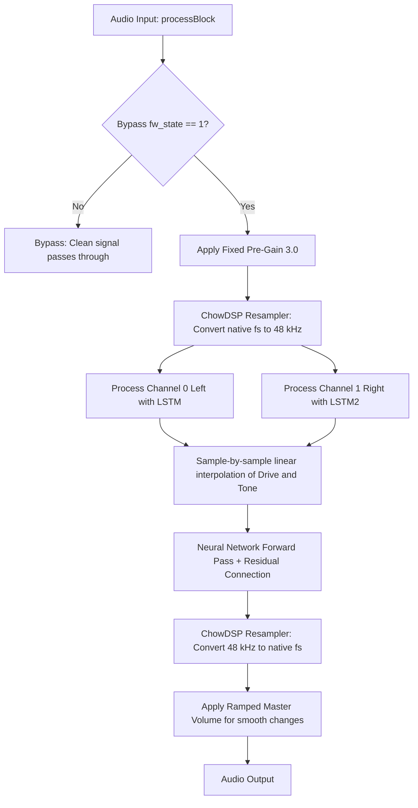

# 🎛️ TS-M1N3 — Technical and Functional Mapping

| 📋 Field | 🔍 Detail |
| :--- | :--- |
| **Organization** | [Ramer Digital](https://www.ramerdigital.com) |
| **Last Revision Date** | June 05, 2026 |
| **Build Status** | ✅ Compiled & Validated (`auval` PASSED) |
| **Target Architecture** | macOS Apple Silicon (`arm64` native, macOS 11.0+) |
| **Versions (Upstream)** | JUCE 8.0.13 • RTNeural (main) • chowdsp_utils 2.4.0 • json 3.12.0 |
| **Keywords** | `JUCE 8` • `RTNeural` • `LSTM` • `Audio DSP` • `VST3/AU` • `Resampling` • `r8brain` |
| **Purpose** | Digital emulation of an analog overdrive pedal (Ibanez TS-9) using real-time Machine Learning (LSTM). |

---

This file serves as a quick and complete technical reference for the **TS-M1N3** project. Use this document at the start of new conversations with AI models to avoid re-analyzing the entire codebase from scratch.

---

## Conventions & Rules
*   **Context Mapping**: The [ramer.md](ramer.md) file at the project root is the technical source of truth and must be updated/loaded at the start of any new conversation.
*   **Daily Achievement Logs**: At the end of each workday or release cycle, a progress log must be created or updated in the format `done-[yyyyMMdd].md` (e.g., `done-20260605.md`) in the private local developer folder outside this repository to keep this history private.
*   **Language Policy**: All documentation, comments, variable names (where possible), commits, and achievement logs (`done-[yyyyMMdd].md`) must be written in **International English**.
*   **AI/Agent Push Restriction**: The AI/Agent is strictly prohibited from pushing any commits or branches to the remote repository (`origin`) without an approved implementation plan and explicit manual user validation and agreement.
*   **AI/Agent Git Commit and Build Confirmation**: The AI/Agent is strictly prohibited from performing local git commits or triggering builds without first requesting explicit manual user confirmation and agreement.
*   **Branch Policy**: If the conversation starts on the `master` branch, the AI/Agent must request the user's authorization to switch the branch to `development`.
*   **Markdown Link Policy**: All markdown documents (`*.md`) in the repository must use only logical/relative paths for file links (e.g., `[PluginEditor.cpp](Source/PluginEditor.cpp)` instead of absolute `file://` URLs).

---

## 1. Project Overview
*   **Goal**: Emulate the dynamic behavior of the analog TS-9 overdrive pedal using Recurrent Neural Networks (LSTM).
*   **Base Framework**: [JUCE Framework](https://github.com/juce-framework/JUCE) (C++).
*   **Neural Inference Engine**: [RTNeural](https://github.com/jatinchowdhury18/RTNeural) (highly optimized real-time DSP engine).
*   **Resampling**: [r8brain-free-src](https://github.com/avaneev/r8brain-free-src) and [chowdsp_utils](https://github.com/Chowdhury-DSP/chowdsp_utils) to ensure stable processing at the model's native sample rate (48 kHz).
*   **License**: GNU GPL v3.

---

## 2. Functional Architecture and Parameters

The plugin emulates the physical pedal using the following controls:
1.  **Drive (Overdrive Gain)**: Conditioned parameter of the neural network. Controls the level of distortion. Mapped in JUCE under the ID `"drive"`, ranging from `0.0` to `1.0` (default `0.5`).
2.  **Tone (Tone Filter)**: Conditioned parameter of the neural network. Controls frequency response (brightness/treble cut). Mapped under the ID `"tone"`, ranging from `0.0` to `1.0` (default `0.5`).
3.  **Level (Master Volume)**: Output gain adjustment applied post-emulation. Mapped under the ID `"level"`, ranging from `0.0` to `1.0` (default `0.5`).
4.  **Bypass/Active (Footswitch)**: Physical toggle on the graphical interface (`odFootSw`) that switches the bypass state (`fw_state`).
    *   `fw_state = 0`: Bypass (clean signal bypass).
    *   `fw_state = 1`: Active pedal (neural processing enabled).
5.  **Status LED**: Red LED (`odLED`) turns on when the pedal is active.

---

## 3. Directory and File Structure

*   `CMakeLists.txt`: Main root build file. Defines the project, target architectures (e.g., macOS native `arm64`), JUCE flags, and dependencies.
*   `_build.sh`: Script to clean, generate the CMake Xcode workspace, and optionally compile the target using ad-hoc signing (`--adhoc`).
*   `Source/`:
    *   [PluginProcessor.h](Source/PluginProcessor.h) / [PluginProcessor.cpp](Source/PluginProcessor.cpp): Audio processor. Loads the model, resamples input blocks to 48 kHz, manages audio buffers, and applies volume/gains.
    *   [PluginEditor.h](Source/PluginEditor.h) / [PluginEditor.cpp](Source/PluginEditor.cpp): Graphical User Interface (GUI). Defines Sliders and ImageButtons for the footswitch and LED.
    *   [RTNeuralLSTM.h](Source/RTNeuralLSTM.h) / [RTNeuralLSTM.cpp](Source/RTNeuralLSTM.cpp): Wrapper around RTNeural inference. Initializes JSON weights, maps LSTM/Dense layers, and performs sample-by-sample linear parameter interpolation to prevent zipper noise (clicks).
    *   [myLookAndFeel.h](Source/myLookAndFeel.h) / [myLookAndFeel.cpp](Source/myLookAndFeel.cpp): Overrides default slider and button rendering using stacked PNG filmstrips.
*   `models/`:
    *   `model_ts9_48k_cond2.json`: Active neural network weights. Specially trained for 48 kHz sampling rate with 2 conditional variables (Drive and Tone).
*   `modules/`: Git submodules for dependencies (JUCE, RTNeural, chowdsp_utils, json, r8brain-free-src).
*   `resources/`: Images for knobs, footswitch, LEDs, logos, and the pedal background (`ts_background_black.jpg`). Compiled via `juce_add_binary_data`.

---

## 4. Technical Audio Processing Flow (DSP)

Below is the detailed logical flow of each block's processing in [PluginProcessor.cpp](Source/PluginProcessor.cpp):

### DSP Operational Details
*   **Pre-Gain**: The input audio signal is multiplied by a fixed factor of `3.0` before entering the neural network.
*   **Parameter Smoothing (Smoothing)**:
    *   To avoid sudden parameter transitions that cause audio clicks ("zipper noise"), the `RT_LSTM` class calculates a linear step delta per sample: `steppedValue = (targetParam - previousParam) / numSamples`.
    *   The `drive` and `tone` values are dynamically interpolated for each sample in the buffer.
*   **Neural Inference**:
    *   The neural network is composed of:
        1.  Input layer: 3 nodes (`[audio_sample, conditioned_drive, conditioned_tone]`).
        2.  LSTM layer: 32 hidden units (`RTNeural::LSTMLayerT<float, 3, 32>`).
        3.  Dense layer: 32 inputs -> 1 output (`RTNeural::DenseT<float, 32, 1>`).
    *   The final output sample is the sum of the dense layer's output and the input sample (residual connection): `outData[i] = model.forward(inArray) + inData[i]`.
*   **Resampling**: The machine learning model operates strictly at **48 kHz**. The Chowdhury DSP resampler converts any host rate (e.g., 44.1 kHz, 96 kHz) to 48 kHz before applying the model, and then converts it back to the DAW's rate.

---

## 5. Licensing and Compliance (GPLv3)

Since this project is a fork of a GPLv3 licensed project, the following obligations and limitations apply:

### Dependency License Map
| Dependency | License | GPLv3 Compatibility | Details |
| :--- | :--- | :--- | :--- |
| **TS-M1N3 Core** | GPLv3 | Identical License | All fork code must remain under GPLv3. |
| **JUCE Framework** | GPLv3 / Commercial | Compatible | JUCE allows usage under GPLv3 without commercial fees. |
| **RTNeural** | BSD 3-Clause | Compatible | Permissive, can be embedded in GPLv3 software. |
| **chowdsp_utils** | GPLv3 | Identical License | Fully compatible. |
| **r8brain-free-src** | MIT | Compatible | Permissive. |
| **nlohmann/json** | MIT | Compatible | Permissive. |

### Distribution Rules
1.  **Source Code Disclosure**: If you distribute compiled binaries of this emulation, you must make the corresponding complete source code publicly available (including modified submodules).
2.  **JUCE Splash Screen**: The `CMakeLists.txt` sets `JUCE_DISPLAY_SPLASH_SCREEN=0`. The free tier of JUCE requires displaying the splash screen **unless** the project is released under GPLv3. Since this project is GPLv3, removing the splash screen is fully compliant.

---

## 6. History of Corrected Issues

The following issues have been resolved:

1.  **LSTM Hidden Size Correction**:
    *   *Before*: `README.md` claimed 20, but the code in `RTNeuralLSTM.h` defined 32.
    *   *Fix*: Updated `README.md` to document the correct hidden size of 32, aligning it with the active model configuration.
2.  **Inactive JSON Model**:
    *   *Before*: `model_ts9_cond2.json` was on disk and bundled in BinaryData without active usage.
    *   *Fix*: Excluded the file from the repo and removed it from `resources/CMakeLists.txt` to reduce binary footprint.
3.  **Windows Background Drawing Workaround**:
    *   *Before*: Contained complex conditional logic for windows clipping workarounds.
    *   *Fix*: Simplified `paint` in `PluginEditor.cpp` to use standard `g.drawImageAt(background, 0, 0)`, which is fully cross-platform and reliable.
4.  **Resampler Heap Corruption Bug (Audio DSP)**:
    *   *Before*: Dynamic host buffer sizes (e.g., during DAW init) sub-allocated the resampler. At high sample rates (192kHz), block overflow corrupted adjacent memory, yielding severe audio distortion (lo-fi).
    *   *Fix*: Sanitized sample rates in `PluginProcessor.cpp` and set a safe minimum resampler allocation limit of `4096` samples.
5.  **Submodule Upgrade to Latest Upstream Versions**:
    *   *Before*: Submodules were pinned to very old commits from years ago, hindering fork advancement.
    *   *Fix*: Updated all submodules to their latest upstream releases. Adapted modules target in `modules/CMakeLists.txt` to `chowdsp::chowdsp_dsp_utils`, adjusted buffer processing to the new `BufferView` API in `PluginProcessor.cpp`, and sorted includes in `RTNeuralLSTM.h` to avoid JSON ABI namespace conflicts.
6.  **Resampler Latency and DAW Synchronization Fix**:
    *   *Before*: The voxengo `CDSPResampler24` backend used a 2.0% transition band and 180 dB attenuation by default, introducing a ~70.8 ms roundtrip latency at sample rates other than 48 kHz. This was unplayable for real-time monitoring and, because it was never reported to the host via `setLatencySamples()`, caused out-of-sync playback in DAWs.
    *   *Fix*: Switched to `r8b::CDSPResampler` with optimized parameters (12.0% transition band and 100 dB attenuation), lowering latency to under 10 ms (specifically ~9.2 ms) which is completely playable and transparent for guitar signals. Implemented `getLatencySamples()` across the resampler classes and reported the combined latency to the DAW inside `prepareToPlay()` using `setLatencySamples()` for automatic DAW synchronization.
